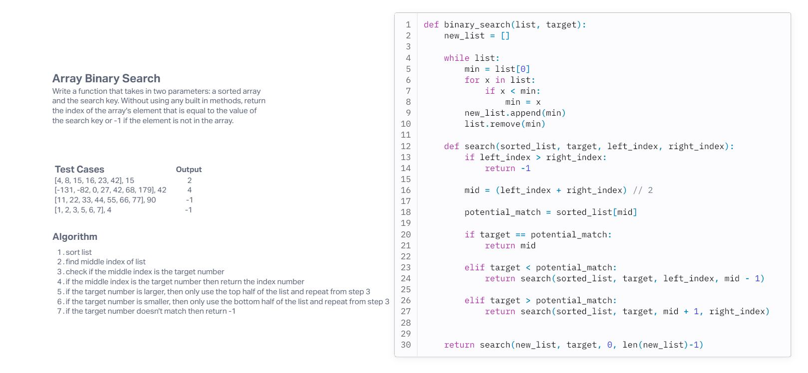

# Challenge Title
Array Binary Search

## Whiteboard Process

## Approach & Efficiency
<!-- What approach did you take? Why? What is the Big O space/time for this approach? -->
The approach that I took for this code challenege was look at my prevous work and see if I could implement any aspects of it into this code challenge. The only aspect of my previous code that I was able to utilize was finding the middle index. Everything else I had to reserch.

In this code challenge I used recusion, but I believe it was linear beacuse it doesn't exponetially grow. 

## Solution
These are the test cases that were given.

print(binary_search(case1, num1))
print(binary_search(case2, num2))
print(binary_search(case3, num3))
print(binary_search(case4, num4))

If you wanted to test your own cases then you would need to pass a list in the first paramater and a target number in the second paramater.

Then run the script and it will return the index number of the 