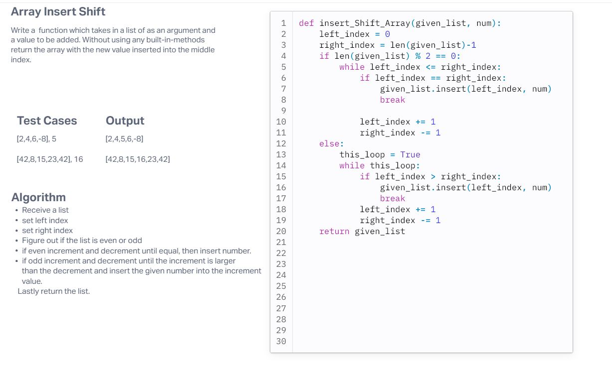

# Challenge Title
Array Insert Shift

## Whiteboard Process

## Approach & Efficiency
<!-- What approach did you take? Why? What is the Big O space/time for this approach? -->
The approach that I took is writing out my ideas on how I would do this in my head. Then working out the code and finding out if it is possible to solve. If not, I take that information and go back to the drawing board and rewrite the idea in my head. The big O space/time is linear beacuse we are using only looping through the array to be able to solve our problem.

## Solution
To run this code you need to give it a list and a number that you want to add to the middle of the list.