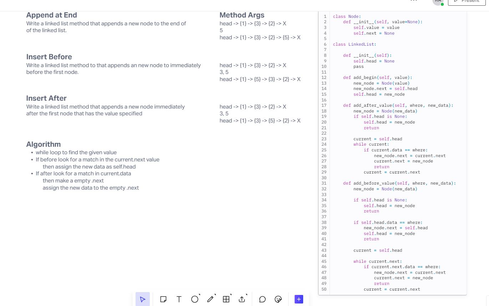

# Challenge Title
linked list insertions

## Whiteboard Process

## Approach & Efficiency
These are linear methods. It is dependent on the size of the linked list and where specifically you want to add the new data.

## Solution

To run the code you need to call on the method in the class and pass in the value you want to insert and return a 