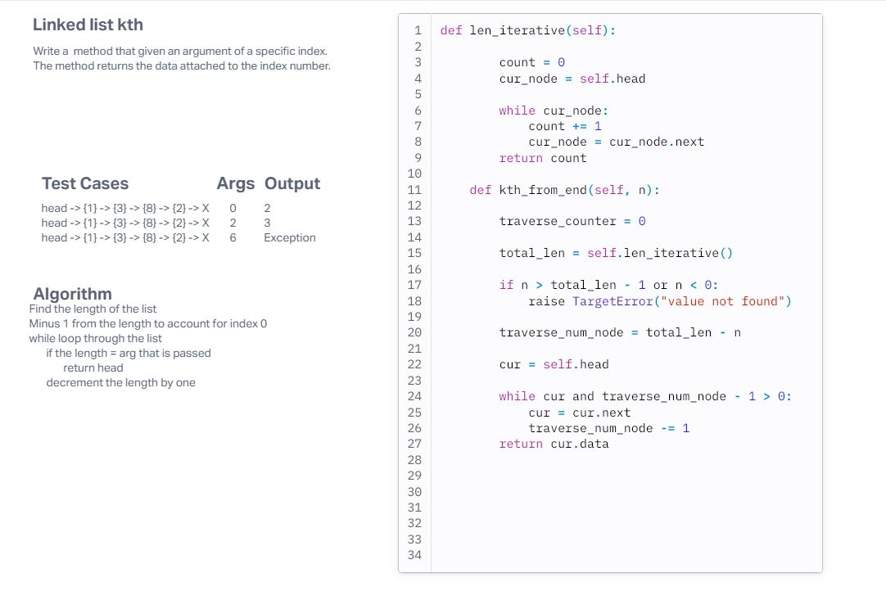

# Challenge Title
linked list kth

## Whiteboard Process

## Approach & Efficiency
<!-- What approach did you take? Why? What is the Big O space/time for this approach? -->
I knew this was going to be another linear method because it itterates through the linked list looking for the specific index position.
## Solution
<!-- Show how to run your code, and examples of it in action -->
To run the code, insert some data into the linked list. Then call on the method and pass an argument for the specific index you want the data from. The method will return the data from that index or return an error if the index was not able to be found.