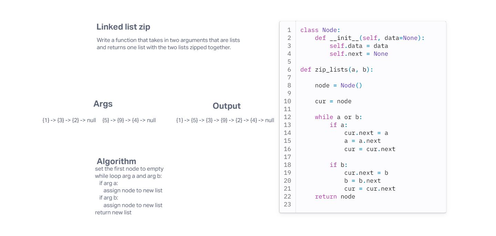

# Challenge Title
linked list zip

## Whiteboard Process

## Approach & Efficiency
my approach was to while loop through each argument and append a new node for each argument. This is another linear function because it only matters how large the lists are.

## Solution
Given two values, the zip function will zip the two lists together. 