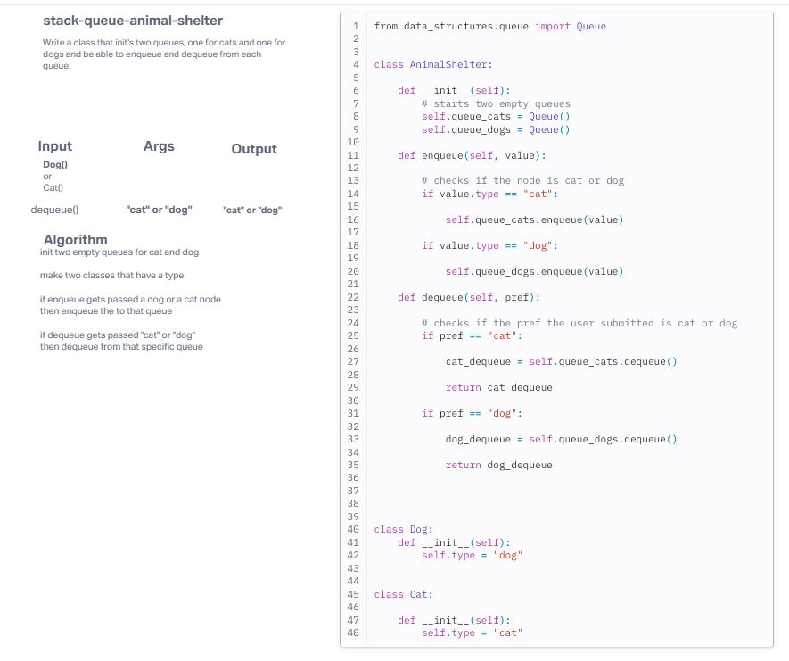

# Challenge Title
stack-queue-animal-shelter

## Whiteboard Process

## Approach & Efficiency
<!-- What approach did you take? Why? What is the Big O space/time for this approach? -->
My apporach for this lab was to fully understand what the challenge was asking. The hardest part was wrapping my head around the individual cat and dog nodes. The O notation is n(1), which is linear because it only matters on the amount of data that gets passed to the queue.

## Solution
<!-- Show how to run your code, and examples of it in action -->
To run the code you need to initalize a cat or a dog node. Then pass the node as an argument for the enqueue. To dequeue just pass "cat" or "dog" and it will dequeue from the respective queue.