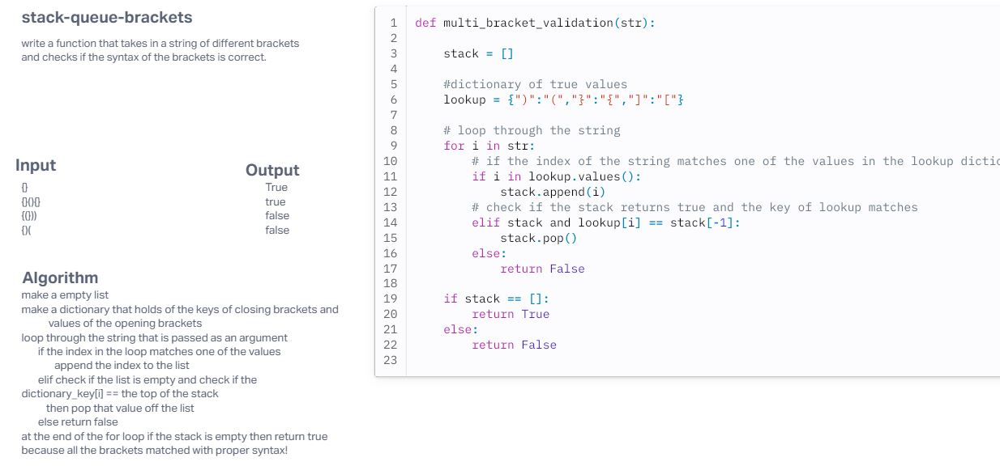

# Challenge Title
stack-queue-brackets

## Whiteboard Process
<!-- Embedded whiteboard image -->

## Approach & Efficiency
<!-- What approach did you take? Why? What is the Big O space/time for this approach? -->
The approach I took for this challenge was, making an empty list and appending the value to that list if it was the correct value. If it wasn't in that list then check if the closing bracket matches the opening. If so then pop that value from the list. The O notation is linear beacuse it only matters on how big the sting that is inputed.
## Solution
<!-- Show how to run your code, and examples of it in action -->
To run the code, call the function and pass in a string of brackets. If the brackets have the correct syntax then it will return True, and if not then it will return false.
