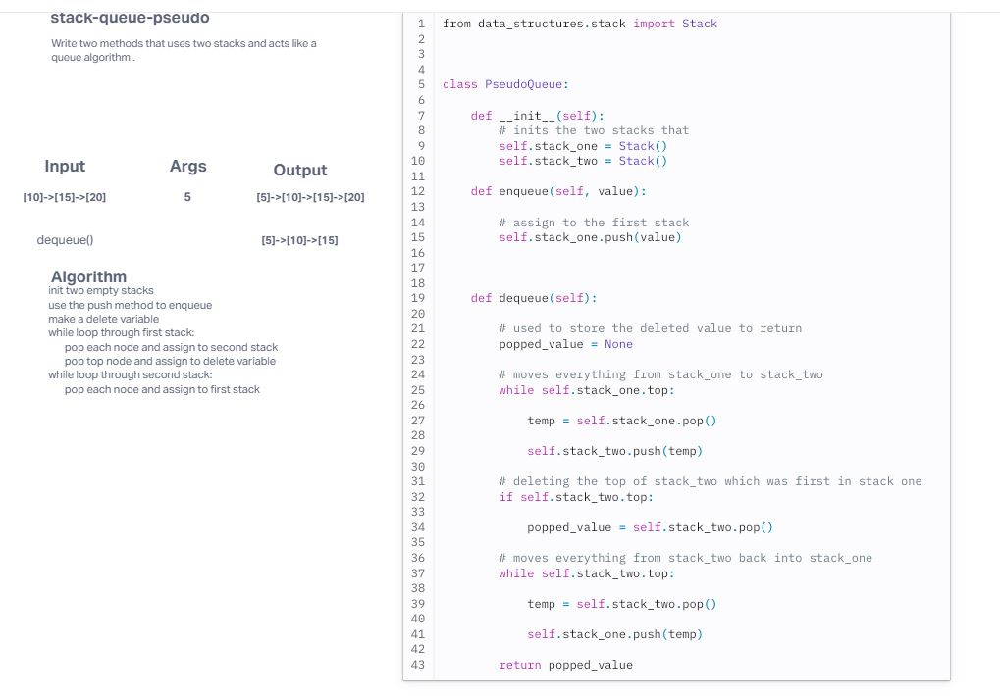

# Challenge Title
stack queue pseudo

## Whiteboard Process
<!-- Embedded whiteboard image -->

## Approach & Efficiency
<!-- What approach did you take? Why? What is the Big O space/time for this approach? -->
The approach that I took was to trully understand what the challenge was asking for me to do. Once I understood that we were suppose to make a queue algorithm using a stack algorithm it all fell into place. This is a linear funtion beacuse it only matter on how big the stack is. 

## Solution
<!-- Show how to run your code, and examples of it in action -->
To run the test, pass data into enqueue(data). That node will be first in line if there is no other nodes in the the queue. If you call on dequeue(), then it will remove what ever node is first in line.