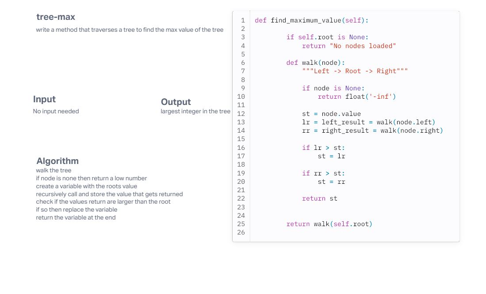

# Challenge Title
Tree Max

## Whiteboard Process
<!-- Embedded whiteboard image -->

## Approach & Efficiency
<!-- What approach did you take? Why? What is the Big O space/time for this approach? -->
My approach was to just check if the values are greater than the root node. If so then replace the variable then at the end return the varibale. The time complexity is O(n) because we are just traversing the tree one by one. 

## Solution
<!-- Show how to run your code, and examples of it in action -->
To run the code you need to call instantiate the class then pass some nodes into the tree. Once that is done then call the finction find_maximum_value(). This will return the tree with the highest largest intiger. 